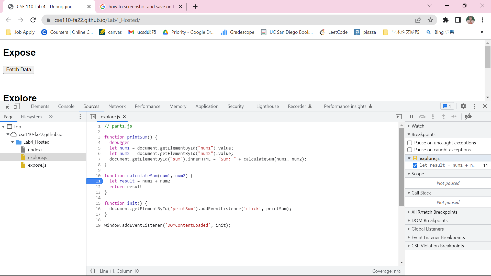
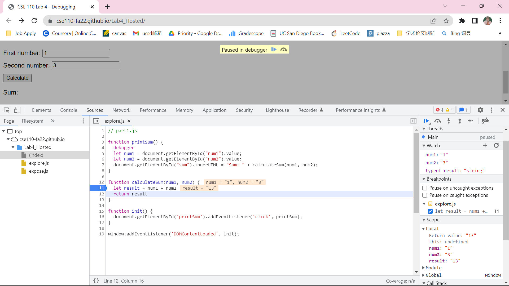
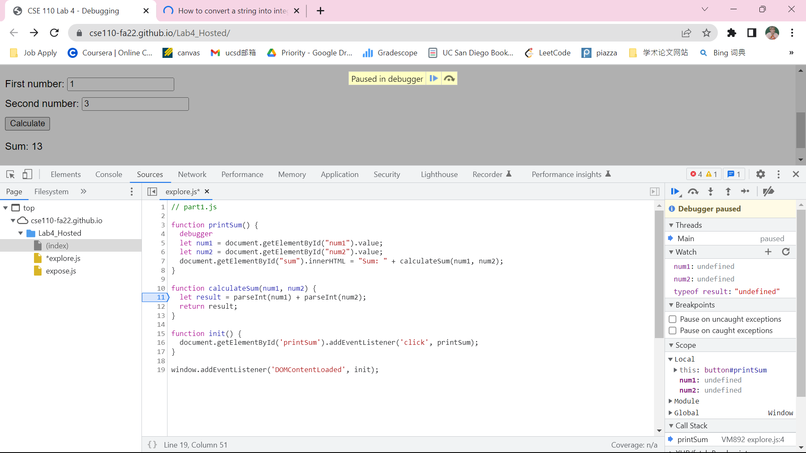

# Explore Part 1 #
## Screenshots ##

result-calculateSum

result-dataType

## Question 1 ##
The bug is that both num1 and num2 are of data type string, so the result is also data type string that combine strings num1 and num2 together rather than adding these two integers together.

## Question 2 ##
We can solve this problem by converting the data type of num1 and num2 into integer.
